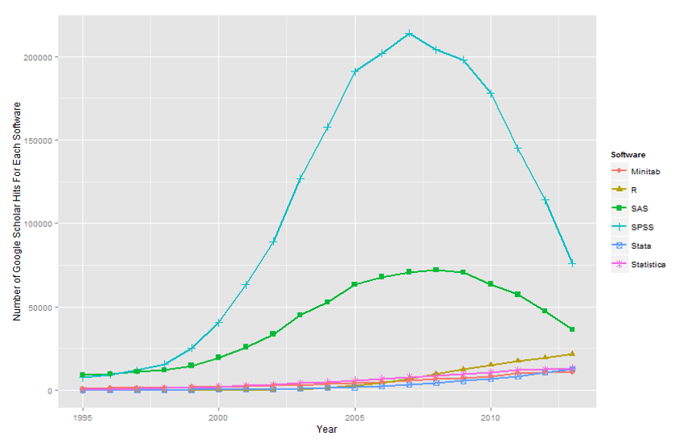

```{r setup, include=FALSE}
knitr::opts_chunk$set(echo = T,
                      warning = F,
                      message = F,
                      comment = NA,
                      fig.align="center")
Sys.setlocale("LC_ALL", "UTF-8")
```

<style>
.tip{
  background-color:rgba(204,229,255,0.5);
  text-align:left;
  color:rgb(0,102,204);
  vertical-align: middle;
  padding:10px 0; 
  margin:10px;
  border-radius: 5px;
  border:1px solid rgba(204,229,255,0.7);
}
.tip a{
  color:rgb(0,51,102);
}
</style>

# Sissejuhatus R keelde

## Teaser
- <a href="https://martenveskimae.github.io/stat-mod/rahalised_annetused.html">Rahalised annetused erakondadele</a>

### Paketid

```{r}
library(tidyverse)
```

## Taustaks

R on statistikale ja andmete visualiseerimisele suunatud vabavaraline programmeerimiskeel. R loodi 90ndate alguses S-i baasile ning on tasapisi muutunud üheks enimkasutatavaks statistika tarkvaraks.


<a href="http://r4stats.com/2014/08/20/r-passes-spss-in-scholarly-use-stata-growing-rapidly/">R Passes SPSS in Scholarly Use, Stata Growing Rapidly (2014)</a>

R-il on olulisi eeliseid mitmete teiste statistikatarkvarade ees:

- R on eeskätt programmeerimiskeel, mis tähendab, et see võimaldab luua uusi funktsioone vastavalt eesseisvale probleemile;
- R on vabavaraline ning kasvava populaarsusega, mis tähendab, et uute meetodid jõuavad R-i kasutajateni enne teisi;
- R jookseb kõikidel levinud OS-idel ning on tasuta kättesaadav;
- R ühildub mitmete teiste keeltega, mis teeb selle laiemalt kasutatavaks (näiteks käesolev **markdown-i** dokument);
- R pakub visualiseerimisel tõenäoliselt parimat tasakaalu lihtsuse ja esteetilisuse vahel;
- R on tõenäoliselt üks parimaid vahendeid statistika tegemiseks ka aastakümne pärast, mis tähendab, et selle õppimiseks kulutatud aeg pole raisatud.

Sellega seoses on sel ka miinuseid:

- nõuab uue keele õppimist, mis võib olla alguses keeruline;
- aeg ajalt esineb uuemates pakettides vigu, mis tähendab, et tuleb olla tähelepanelik;
- seab kõrgemad nõuded meetodite tundmisele.

## Kasulikud lingid

Sissejuhatus:

- <a href="http://dplyr.tidyverse.org">Grammar of Data Manipulation • dplyr</a>
- <a href="http://ggplot2.tidyverse.org">Elegant Data Visualisations Using the Grammar of Graphics • ggplot2</a>
- <a href="http://www.statmethods.net/input/dates.html">Date Values</a>
- <a href="https://www.tutorialspoint.com/r/r_operators.htm">R - Operators</a>
- <a href="http://rmarkdown.rstudio.com/lesson-1.html">R Markdown</a>

Jaotus ja keskmised:

- <a href="https://www.datacamp.com/community/tutorials/r-tutorial-apply-family#gs.oydmaoU">Tutorial on the R Apply Family</a>
- <a href="http://seananderson.ca/2013/10/19/reshape.html">An Introduction to reshape2</a>

Usaldusvahemikud:

- <a href="https://en.wikipedia.org/wiki/Bootstrapping_(statistics)">Bootstrapping</a>

Keskmiste võrdlus:

- <a href="https://www.rdocumentation.org/packages/dplyr/versions/0.7.3/topics/case_when">case_when</a>

Visualiseerimine:

- <a href="https://www.nceas.ucsb.edu/~frazier/RSpatialGuides/colorPaletteCheatsheet.pdf">R Color Cheatsheet</a>

Lineaarne regressioon: 

- <a href="http://www.jakeruss.com/cheatsheets/stargazer/">Stargazer cheatsheet</a>

Logistiline regressioon:

- <a href="https://en.wikipedia.org/wiki/Exponential_family">Eksponentide perekond</a>
- <a href="http://thomasleeper.com/Rcourse/Tutorials/binaryglmplots.html">Binary Outcome GLM Plots</a>

Huvitavat:

- <a href="https://www.youtube.com/watch?v=jk9S3RTAl38&ab_channel=StatisticalLearning">John Chambers, S-i looja (intervjuu)</a>
- <a href="https://www.youtube.com/watch?v=5Dnw46eC-0o&ab_channel=O%27Reilly">John Rauser keynote: Statistics Without the Agonizing Pain</a>

## Installeerimiseks

R-i kasutamiseks piisab vaid R-i "mootori" installeerimisest, kuid mugavam on kasutada graafilist kasutajaliidest, näiteks R-Studiot.

- <a href="https://www.r-project.org">R</a></br>
- <a href="https://www.rstudio.com/products/rstudio/">R studio (GUI)</a>

Kuna R on vabavaraline tarkvara, siis on mitmete R-i funktsioonide kasutamiseks vajalik need esmalt alla laadida. See toimub R-i keskkonnas `install.packages(...)` abil (nt `install.packages("tidyverse")`), mispuhul **pakett** on funktsioonide kogum. Vajaminevate pakettide peale hetkel mõtlema ei pea, need tulevad jooksvalt praktikumide käigus.

## Kui satud hätta..

R-i pakettidel on enamasti küllatki hästi lahti kirjutatud **help** sektsioon, mis on leitav help tabi alt (enamasti paremal all nurgas). Help tabi otsingusse saab kirjutada otsitud funktsiooni nime, misjärel ta kuvab ta funktsiooni kirjelduse ning argumentide väärtused. Enamasti on lisatud mõned näited funktsiooni kasutamisvõimalustest. Võimalik on veel:

- kirjutada konsooli ?funktsiooni nimi (nt `?read.csv()`) või `help(...)`, kuhu läheb argumendiks funktsiooni nimi;
- selekteerida funktsioon ja vajutada klaviatuuril F1.

Lisaks R-is olemasolevale kirjeldusele on mitmed paketid avaldatud teadusajakirjades, eeskätt ajakirjas <a href="https://www.jstatsoft.org/index">Journal of Statistical Software</a>. Samuti on enamus tüüp-probleemid lahendatud <a href="https://stackoverflow.com">Stack Overflow</a> lehel. Mõlemal juhul peaks google viima sobiva lahenduseni.

## Tööpõhimõtted
### Objektid

R-i põhiline töövahend on **objekt**, mis võib sisaldada nii funktsioone kui andmeid. Objekte saab ise luua `<-` või `=` märkide abil (`<-` on mõnevõrra kindlam meetod ja mõned soovitavad kasutada seda. Üldjuhul, sh selle aine raames, piisab ka `=` kasutamisest).

```{r}
x = 5
x
```

Kui soovime siduda rohkem andmeid ühe objektiga, on võimalik luua **vektor** (jada / ühedimensionaalne maatriks).
```{r}
x <- c(5, 12.3, 3:10)
x
```

Objekt võib saada sisendi ka teisest objektidest. Samuti võib teha objektidega tehteid.
```{r}
y = x - 5
y
```

Objektiks võib olla ka funktsioon.
```{r}
lahuta.viis = function(x){
  tmp = x - 5
  return(tmp)
}

y = lahuta.viis(x)
y
```

### Põhilised andmetüübid

Numbrid:
```{r}
x = 1
str(x)
```

Tähemärgid (numbrid muudetakse tähemärkideks):
```{r}
x = c("a", "b", 1, 2)
str(x)
```

Faktorid (identsed elemendid saavad sama koodi):
```{r}
x = as.factor(c("a", "b", "1", "2", "a", "2"))
str(x)
```

Kuupäevad:
```{r}
x = as.Date("2017-09-01")
str(x)
```

Kuupäevade puhul on oluline jälgida formaati. Vaikimisi on selleks **yyyy-mm-dd**, kuid kui sisse loetavad andmed on teises formaadis, tuleks see `as.Date(...)` käskluses täpsustada `format` või `origin` argumentidega. Formaatidest pikemalt: <a href="http://www.statmethods.net/input/dates.html">Date Values</a>.

```{r}
as.Date("01-09-2017", format="%d-%m-%Y")
as.Date(17410, origin="1970-01-01")
```

### Andmetabelid

Seni vaadatud jadad on olnud kõik ühedimensionaalsed, ent andmed võivad olla ka mitmedimensionaalsed. Enimlevinud mitmedimensionaalsed formaadid on **andmetabelid** ja **maatriksid**, millest peamiselt keskendume esimesele. Maatriks on kahedimensionaalne vektor, mis on justkui mitu vektorit kokku liidetuna, kuid kõik vektorid peavad olema sama liiki andmetega.

```{r}
matrix(1:9, nrow=3, byrow = T)
matrix(letters[1:9], nrow=3, byrow = T)
```

Mitu samapikkust vektorit saab liita kokku üheks ka andmetabeliks ehk data frameiks (`data.frame(...)`). Data frame'i erinevus seisneb selles, et veerud võivad sisaldada eritüüpi andmeid (nt üks veerg on numbriline, teine sisaldab faktoreid jne).
```{r}
x = c(1:4)
y = c("Audi", "DAF", "Ford", "GAZ")
z = x-5

df = data.frame(tunnus.1 = x,
                tunnus.2 = y,
                tunnus.3 = z)
df
```

Andmetabelite tunnuseid (ehk veerge) saab kätte ka vektorina kasutades `$` märki:
```{r}
df$tunnus.2
```

Võimalik on kasutada ka indeksi (järjekorra) numbrit kandilistes sulgudes. Andmetabelite puhul on esimene number rea number ning koma järel veeru number. Vektori puhul piisab vaid rea numbrist.
```{r}
df[,2]
df["tunnus.2"]
df[1,]["tunnus.2"]
df[1,2]
df$tunnus.2[2]
```

### Listid

Kõiki erinevaid objekte saab koondada listidesse (`list(...)`). List on hea koondamaks erinevate pikkustega või erineva iseloomuga, kuid samateemalisi andmeid. Tihti võib liste kohata erinevate funktsioonide väljundites.

```{r}
ls = list(df)
ls[[2]] = c(1:10)
ls[[3]] = y[2:4]

ls
```

### Funktsioonid objektide kohta

Kõikide objektide puhul:

- `str(...)` - objekti struktuur
- `typeof(...)` - storage mode
- `is.numeric(...)` - kas on...
- `is.character(...)`
- `is.factor(...)`
- `is.function(...)`
- `is.logical(...)`

...

Vektori puhul:

- `length(...)` - vektori pikkus

Data frame'i puhul:

- `dim(...)` - data frame'i dimensioonid (ridu, veerge)
- `nrow(...)` - ridade arv
- `ncol(...)` - veergude arv

Formaadi muutmiseks:

- `as.vector(...)` - vektor
- `as.matrix(...)` - maatriks
- `as.Date(...)` - kuupäev
- `as.data.frame(...)` - data frame
- `as.list(...)` - list

## Andmestike laadimine

R suudab lugeda sisse enamikke levinud andmefailide formaate, kuid kõige sagedasemalt kasutatakse .csv (*comma separated values*). Andmestike sisse lugemiseks on erinevaid funktsioone, kuid .csv-de puhul piisab `read.csv(...)`. `read.csv(...)` võimaldab muu hulgas määratleda, kuidas on eraldatud erinevad veerud (`sep`; koma, semikooloni vm abil) ja mida kasutatakse komakohtade eraldamiseks (`dec`; punkt, koma vm). See võib olla oluline, kuna erinevad programmid erinevatel OS-idel võivad kasutada erinevaid standardeid.

### Internetist

```{r}
url = "https://martenveskimae.github.io/stat-mod/party_dataset.csv"
df = read.csv(url)
```

Andmestiku vaatamiseks võib küsida tervet andmestikku, aga võib ka küsida esimesi või viimaseid ridu. Selleks saab kasutada nii indeksi kui ka eraldi funktsioone `head(...)` ja `tail(...)`.

```{r}
df[1:6, 1:4]

head(df[,1:4])
tail(df[,1:4])
```

Et näha, millised tunnused andmestikus on, võib küsida tunnuste pealkirju `colnames(...)` funktsiooiga.

```{r}
colnames(df)
```

### Kohalikult kettalt

Kohalikult kettalt andmestike laadimiseks tuleb märkida ära andmestiku asukoht kettal. Selle lihtsustamiseks on otstarbekas märkida ära töökeskonna asukoht.

Olemasoleva asukoha nägemiseks on funktsioon `getwd()`.
```{r}
getwd()
```

Kui tahta seda muuta, saab kasutada `setwd(...)` funktsiooni, kus argumendiks on soovitud uus asukoht.

## Andmetega tutvumine

Kokkuvõtvaid andmed nii andmetabelite kui teiste andmeformaatide kohta näeb funktsiooniga `summary(...)`.
```{r}
summary(df)
```

Faktortunnuste puhul võib pakkuda huvi, millised erinevad kategooriad on andmestikus esindatud. Näiteks võime vaadata, millised erakonnad andmestikus leiduvad.
```{r}
levels(df$party)
```

Kui soovida täpsemat ülevaadet, näiteks, mitu andmepunkti on iga erakonnaga seotud, siis selleks on hea kasutada paketti **tidyverse**. Tidyverse hõlmab endas mitmeid erinevaid, kuid omavahel ühilduvaid pakette. Üks neist, **dplyr**, pakub mitmeid funktsioone andmete mugavaks töötlemiseks (eeskätt filtreerimine, grupeerimine, tunnuste muutmine jne). Teine oluline eelis tuleneb paketist **magrittr**, mis võimaldab käsklusi sisestada jadana (ing.k *pipe*). See kiirendab tööprotsessi ja muudab R-i koodi kergemini jälgitavaks. Pipe'ide kasutamiseks tuleb kahe funktsiooni vahel lisada `%>%` sümbolid. Enne näite juurde liikumist on vajalik tidyverse aktiveerida, milleks on funktsioon `library(...)`.

```{r}
library(tidyverse)
```

Pipe'i näide võib olla järgnev:
```{r}
c(1:10) %>% lahuta.viis()
```

Järgnevalt tutvume, mitu rida on seotud üksikute erakondadega (sagedustabel). 
```{r}
df %>%
  group_by(party) %>%
  summarize(n = n())
```

**dplyr** kohta leiab rohkem informatsiooni siit: <a href="http://dplyr.tidyverse.org">Grammar of Data Manipulation • dplyr</a>

## Filtreerimine & joonised 

Kõige kiirem viis andmete visualiseerimiseks on kasutada funktsioone `plot(...)` või `hist(...)`, kus tuleb määratleda telje/telgede väärtused.

```{r}
plot(df$year, df$support)
```

```{r}
hist(df$support)
```

Paraku ei ole antud funktsioonid väga mugavad tidyverse'is kasutamiseks ning kujunduse muutmine on piiratud võimalustega. Kõige enim levinud viis andmete visualiseerimiseks R-i keskkonnas on paketiga **ggplot2**, mis on samuti tidyverse'i osa.

```{r}
df %>%
  filter(party=="ref") %>%
  ggplot() +
  geom_point(aes(year, support))
```

```{r}
df %>%
  filter(party=="ref") %>%
  ggplot() +
  geom_histogram(aes(support))
```

<div class="tip">
**Võrdlusoperaatorid**

Filtreerimisel või muude võrdluste tegemisel kasutatakse teatud tingmärke, mida nimetatakse võrldusoperaatoriteks. R-is on need järnevad:

Operaator   | Tulemus
----------- | -----------
`==`        | Võrdne
`!=`        | Mittevõrdne
`>`         | Suurem
`<`         | Väiksem
`>=`        | Suurem-võrdne
`<=`        | Väiksem-võrdne
`%in%`      | Sisaldab

**Loogilised operaatorid**

Olukordades, kus soovime mitut võrdlust/tingimust kombineerida, tuleb erinevad komponendid siduda omavahel loogiliste operaatoritega:

Operaator   | Tulemus
----------- | -------------------------------------------------------------------------------------------------------------
`&`         | Loogiline JA üksikute vektori komponentide kohta (väljund on TRUE/FALSE kõigi vektori komponentide kohta)
`&&`        | Loogiline JA kõigi vektori komponentide kohta (väljund on ainult üks TRUE/FALSE kogu vektori kohta)
`|`         | Loogiline VÕI üksikute vektori komponentide kohta (väljund on TRUE/FALSE kõigi vektori komponentide kohta)
`||`        | Loogiline VÕI kõigi vektori komponentide kohta (väljund on ainult üks TRUE/FALSE kogu vektori kohta)
`!`         | Loogiline mittesamaväärsus


Näiteid: <a href="https://www.tutorialspoint.com/r/r_operators.htm">R - Operators</a>
</div>

Kujunduse kiireks muutmiseks on erinevad valmislahendused, algusega `theme_`.
```{r}
df %>%
  filter(party=="ref") %>%
  ggplot() +
  geom_point(aes(year, support)) +
  theme_bw()
```

**ggplot2** kohta leiab rohkem informatsiooni siit: <a href="http://ggplot2.tidyverse.org">Elegant Data Visualisations Using the Grammar of Graphics</a>

# Jaotus ja keskmised

### Paketid

```{r}
library(tidyverse)
library(e1071)
library(reshape2)
```

### Andmestik

```{r}
df = read.csv("https://martenveskimae.github.io/stat-mod/party_dataset.csv")
```

## Histogramm
Vaatame jaotuste järsakust ja sümmeetrilisust visuaalselt histogrammi abil. `geom_histogram(...)` annab vaikimisi sagedusjaotuse, kuid on võimalik valida ka protsente või tõenäosustihedust.

```{r}
df %>%
  ggplot() +
  geom_histogram(aes(support, ..count../sum(..count..))) +
  geom_line(aes(support, ..density../100), stat = "density") +
  scale_y_continuous(labels=scales::percent) +
  scale_x_continuous(labels=scales::percent) +
  labs(y="protsent") +
  theme_bw()
```

**ggplot** võimaldab luua eraldi joonised erinevate gruppide jaoks kasutades `facet_wrap(...)` käsklust.

```{r}
df %>%
  ggplot() +
  geom_histogram(aes(support, ..count../sum(..count..))) +
  geom_line(aes(support, ..density../100), stat = "density") +
  facet_wrap(~party) +
  scale_y_continuous(labels=scales::percent) +
  scale_x_continuous(labels=scales::percent) +
  labs(y="protsent") +
  theme_bw()
```

Silmas tuleb pidada, et sel puhul kalkuleerib **ggplot** tulpade laiused ja hulga üle kõikide kuvatud jooniste, mistõttu erinevad need üksikult kuvatud joonistest. Tulpade hulga ja laiuste kontrollimiseks on argumendid `bins` ja `binwidth`, millest esimene määrab tulpade hulga ja teine laiused. Neid käsklusi ei saa korraga kasutada (binwidth kirjutab binsi üle).

```{r}
df %>%
  ggplot() +
  geom_histogram(aes(support, ..count../sum(..count..)), bins=10, binwidth=0.03) +
  geom_line(aes(support, ..density../100), stat = "density") +
  facet_wrap(~party) +
  scale_y_continuous(labels=scales::percent) +
  scale_x_continuous(labels=scales::percent) +
  labs(y="protsent") +
  theme_bw()
```

## Järsakuse- ja assümmeetriakordaja

Vaatame järsakust ja sümmeetrilisust ka numbriliselt nn järsakuse- ja assümmeetriakordaja abil. Seda võimaldab pakett **e1071**, kust leiame käsklused `skewness(...)` ja `kurtosis(...)` (rakendatavad valemid on leitavad helpist). Kuna soovime rakendada antud käsklusi kõigi gruppide (erakondade) jaoks eraldi, siis tuleks andmestik esmalt filtreerida grupeerimistunnuse alusel (party) ning alles seejärel rakendada antud käsklusi.

```{r}
df %>%
  group_by(party) %>%
  summarise(skewness = skewness(support, na.rm=T),
            kurtosis = kurtosis(support, na.rm=T))
```

<div class="tip">
Alternatiiv **dplyr** meetodile oleks **for loop**. Loopimine on küll võrdlemisi lihtne, kuid vahel mitte kõige efektiivsem viis:

```{r}
parties = as.character(unique(df$party))
s = c()
k = c()
for(i in 1:length(parties)){
  s[length(s)+1] = skewness(df$support[df$party==parties[i]], na.rm=T)
  k[length(k)+1] = kurtosis(df$support[df$party==parties[i]], na.rm=T)
}
names(s) = parties
names(k) = parties
s;k
```

Sama tulemuse saab efektiivsemalt kasutades `apply(...)` käsklust (antud juhul `sapply(...)`. Rohkem applyst: <a href="https://www.datacamp.com/community/tutorials/r-tutorial-apply-family#gs.oydmaoU">Tutorial on the R Apply Family</a>), mis jäljendab eelneva meetodi loogikat.

```{r}
s = sapply(as.character(unique(df$party)), function(x) skewness(df$support[df$party==x], na.rm=T))
k = sapply(as.character(unique(df$party)), function(x) kurtosis(df$support[df$party==x], na.rm=T))
s;k
```
</div>

## Keskmine, mediaan ja mood

Moodi, ehk kõige sagedamini esineva väärtuse leidmiseks eraldi käsklus puudub, ent seda on lihtne leida sagedustabelist.
```{r}
df %>%
  group_by(party, support) %>%
  summarise(n = n()) %>%
  na.omit() %>%
  group_by(party) %>%
  summarise(mode = support[n==max(n)][1])
```

**dplyri** saab kasutada ka keskmise ja mediaani leidmiseks.
```{r}
df %>%
  group_by(party) %>%
  summarise(mean = mean(support,na.rm=T),
            median = median(support,na.rm=T))
```

Viimaks võib kanda leitud väärtused histogrammile, et neid visuaalselt kõrvutada. Kuigi **ggplot** oskab lisada joonistele funktsioone, ei suuda ta praeguses versioonis kuvada eraldi funktsioone eraldi gruppidele (nt kasutades `facet_wrap(~party)`). Otstarbekas on sellisel juhul teha uus andmetabel keskmiste väärtustega. Andmetabeli mugavamaks kasutamiseks pöörame tabeli *laiast* formaadist *pikka* formaati, kasutades selleks **reshape2** paketti ja `melt(...)` funktsiooni. Rohkem **reshape2** ja laia/pika formaadi kohta: <a href="http://seananderson.ca/2013/10/19/reshape.html">An Introduction to reshape2</a>.

```{r}
keskmised = df %>%
  group_by(party, support) %>%
  summarise(n = n()) %>%
  na.omit() %>%
  group_by(party) %>%
  summarise(keskmine = mean(support),
            mediaan = median(support),
            mood = support[n==max(n)][1]) %>%
  melt("party",c("keskmine", "mediaan", "mood"),"Keskmised")

df %>%
  ggplot() +
  geom_histogram(aes(support)) +
  geom_line(aes(support, ..density..), stat = "density") +
  geom_vline(data=keskmised,aes(xintercept=value, linetype=Keskmised, color=Keskmised)) +
  facet_wrap(~party) +
  scale_x_continuous(labels=scales::percent) +
  theme_bw()
```

<div class="tip">
Lisaks mediaanile võivad huvipakkuvad olla ka teised **protsentiilid** (mediaan on 50 protsentiil), eeskätt 25 ja 75 (teisisõnu I ja III kvartiil). Veel võib aeg-ajalt kohta mõistet **kvartiilhaare** (*interquartile range - IQR*), mis tähistab vahemikku I ja III kvartiili vahel. R-is on protsentiilide leidmiseks käsklus `quantile(...)`.

```{r}
sapply(as.character(unique(df$party)), function(x) quantile(df$support[df$party==x],c(.025,.25,.5,.75,.975),na.rm=T))
```
Eelnevalt toodud protsentiilid saab graafida **boxploti** abil, mis kuvab veel lisaks erindid (*outliers*).

```{r}
df %>%
  ggplot() +
  geom_boxplot(aes(party,support)) +
  scale_y_continuous(labels=scales::percent) +
  theme_bw()
```

</div>
# Usaldusvahemikud

### Paketid

```{r}
library(tidyverse)
library(reshape2)
```

### Andmestik

```{r}
df = read.csv("https://martenveskimae.github.io/stat-mod/party_dataset.csv")
```

## Standardhälve

Eelmisest korrast teame, et keskmine toetusprotsent erakonniti erineb, aga erineb ka kõikumine keskmise ümber. Osade erakondade puhul on keskmine toetus stabiilselt ühe tüüpväärtuse ümber, aga teistel mitte. Selle hindamiseks kasutatakse tüüpiliselt *variatsiooni* ja *standardhälvet*, mis on R-is leitav käsklustega `var(...)` ja `sd(...)`. 

<div class="tip">
Variatsioon on *eeldatav* erinevus tõelise väärtuse ja keskmise vahel ruudus:

$Var(X) = E[(X-\mu)^2]$

ehk teisisõnu erinevuste keskmine:

$Var(X) = \frac{ \sum(X-\mu)^2}{N-1}$

```{r}
X = 1:10

var(X)
sum((X - mean(X))^2) / (length(X)-1)
```

(Miks on jagaja $N-1$ ja mitte $N$? Vahe tuleneb sellest, kas meil on andmed kogu populatsiooni kohta või valim populatsioonist, mis on alati väiksem kui N!)

Variatsiooni leidmiseks on erinevused võetud ruutu. Et jõuda tagasi algskaala juurde, tuleks variatsioonist võtta ruutjuur, mis ongi standardhälve:

$\sigma=\sqrt{E[(X-\mu)^2]}$

```{r}
X = 1:10

sqrt(var(X))
sd(X)
```

Standardhälvet võib seega mõista kui keskmist erinevust keskmisest.
</div>

Vaatame erakondade keskmisi ja standardhälvet lähemalt:
```{r}
keskmised = df %>%
  group_by(party) %>%
  summarise(keskmine = mean(support, na.rm=T),
            s.ylemine = keskmine + sd(support, na.rm=T),
            s.alumine = keskmine - sd(support, na.rm=T)) %>%
  melt("party",c("keskmine", "s.ylemine", "s.alumine"), "Varieeruvus")

df %>%
  ggplot() +
  geom_line(aes(as.Date(date), support)) +
  geom_hline(data=keskmised,aes(yintercept=value, linetype=Varieeruvus, color=Varieeruvus)) +
  facet_wrap(~party) +
  scale_y_continuous(labels=scales::percent) +
  labs(x="") +
  theme_bw()
```

## Standardviga ja usaldusvahemikud

Millest see kõikumine keskmine ümber tuleneb on meile teada. Erakondade toetus varieerub ajas erinevalt ja meie arvutatud keskmine näitab tüüpväärtust üle aja. Siin on aga veel üks aga! Erakonna igakuised toetusnumbrid on ise sammuti üks statistiline hinnang (enamasti saadud umbes 1000se valimiga küsitlusest)! Milline on erakondade tõeline toetus populatsioonis on kindlaks tehtav vaid kogupopulatsiooni küsitledes ja seda me teha ei saa. Sellest tulenevalt on meie küsitlustulemustes alati mingi viga sees. Mida saame teha, on hinnata toetusprotsendi vahemikku, kus tõeline toetusprotsent tõenäoliselt asetseks.

Teoreetiliselt tähendaks see olukorda, kus võtaksime populatsioonist, kus on tegelikud teotused erakondadele, lõpmatu arv juhuvalimeid ja leiaks nende valimite toetusprotsendid. Enamasti oleks tulemus sarnane tegeliku toetusega (mida me ei tea), samas teatud olukordades oleks tulemus ühele või teisele poole väga mööda. Kui me teeks nendelt juhuvalimitelt toetusprotsentide graafi, tuleks see normaaljaotusega graaf: 95% juhtumitest langeks +/-1.96 z-skoori vahele. Sellest tulenevalt saaksime hinnata, millisesse vahemikku jääb tõeline tulemus (95% tõenäosusega).

Praktikas seda teha ei saa, sest küsitlused on kallid. Küll aga on võimalik tuletada usaldusvahemik kasutades selleks **standardviga**. Standardviga kirjeldab, kui lähedal on valimi keskmine populatsiooni keskmisele, kasutades selleks üldjuhul variatsiooni ja valimi suurust. Standardvea leidmiseks on erinevaid meetodeid, sõltuvalt andmete iseloomust. Antud juhul on tegu proportsioonidega (erakonna toetust väljendatakse protsendina populatsioonist), mispuhul kasutame proportsiooni standardviga:

$SE_p = \sqrt{\frac{p(1-p)}{N}}$

kus:

- p on protsent (antud juhul erakonna toetusprotsent)
- N valimi suurus (antud juhul 1000)

Usaldusvahemiku leidmiseks tuleb korrutada standardviga soovitud z-skoori väärtusega (nt 95% usaldusvahemiku leidmiseks on see 1.96) ning liita või lahutada erakonna toetusprotsendist:

$p \pm ci_{95} = p \pm 1.96 \cdot SE$

Kuivõrd tegu on küllalt spetsiifilise küsimusega, siis on otstarbekas teha oma funktsioon.

```{r}
ci = function(p,n=1000,z=1.96){
  list(u = p + (z*(sqrt(p*(1-p)/n))),
       l = p - (z*(sqrt(p*(1-p)/n))))
}

df %>%
  mutate(ylemine =  ci(support)[["u"]],
         alumine =  ci(support)[["l"]]) %>%
  melt(c("party", "date"), c("support", "ylemine", "alumine"),"Toetus") %>%
  ggplot() +
  geom_line(aes(as.Date(date), value, color=Toetus)) +
  facet_wrap(~party) +
  scale_y_continuous(labels=scales::percent) +
  labs(x="",y="protsent") +
  theme_bw()
```

<div class="tip">
Lihtsamaks lugemiseks võime jooned üle siluda.
```{r}
df %>%
  mutate(ylemine =  ci(support)[["u"]],
         alumine =  ci(support)[["l"]]) %>%
  melt(c("party", "date"), c("support", "ylemine", "alumine"),"Toetus") %>%
  ggplot() +
  geom_smooth(aes(as.Date(date), value, color=Toetus), se=F, method="lm", formula= y~poly(x, 7), size=.7) +
  facet_wrap(~party) +
  scale_y_continuous(labels=scales::percent) +
  labs(x="",y="protsent") +
  theme_bw()
```
</div>

<div class="tip">
Alternatiivne lähenemine eelnevalt kirjeldatud meetodile oleks simuleerida erakondade toetusprotsente <a href="https://en.wikipedia.org/wiki/Bootstrapping_(statistics)">bootstrap</a> meetodil. Bootstrapi idee seisneb olemasolevast valimist juhuslike valimite võtmises ning nende põhjal huvipakkuvate statistikute arvutamises (eeskätt variatsioon ja standardviga).

Kuna antud juhul on tegu proportsioonidega ning me soovime igat üksikut vaatlust eraldi simuleerida, siis võime seda teha mündiviske loogikal. Mündiviske puhul simuleerib R binaarset jaotust, mille keskmine on meie poolt antud ning jaotus on <a href="https://en.wikipedia.org/wiki/Binomial_distribution">binominaalne</a>. Korrates mündiviske katset piisava arvu kordi (antud juhul katsetame 500ga), saame arvutada simulatsiooni standardhälve ja standardvea.

Mündiviske simulatsiooniks kasutame paketti **mosaic** ning funktsioone `do(...)`, `rFlip(...)` ja `confint(...)`. Käesolevas katses: `do(1000)` kordab katset 1000 korda ning `rFlip(party.n,x)` viskab ühes katses münti nii mitu korda, kui palju on erakonnaga seotud vaatlusi, tõenäosusega x. `confint(...)` arvutab simulatsiooni usaldusvahemikud.

```{r, eval=FALSE}
toetus.sim = function(x,party){
  require(mosaic)
  if(is.na(x)) return(NA)
  party.n = nrow(df[df$party==party & !is.na(df$support),])
  tmp = do(1000) * rflip(party.n,x)
  ci = confint(tmp$prop)
  list(u = ci[["97.5%"]],
       l = ci[["2.5%"]])
}

df %>%
  rowwise() %>%
  mutate(ylemine = toetus.sim(support,party)[["u"]],
         alumine = toetus.sim(support,party)[["l"]]) %>%
  melt(c("party", "date"), c("support", "ylemine", "alumine"),"Toetus") %>%
  ggplot() +
  geom_smooth(aes(as.Date(date), value, color=Toetus), se=F, method="lm", formula= y~poly(x, 7), size=.7) +
  facet_wrap(~party) +
  scale_y_continuous(labels=scales::percent) +
  labs(x="",y="protsent") +
  theme_bw()
```

```{r, echo=FALSE}
load("sim.Rda")
sim %>%
  melt(c("party", "date"), c("support", "ylemine", "alumine"),"Toetus") %>%
  ggplot() +
  geom_smooth(aes(as.Date(date), value, color=Toetus), se=F, method="lm", formula= y~poly(x, 7), size=.7) +
  facet_wrap(~party) +
  scale_y_continuous(labels=scales::percent) +
  labs(x="",y="protsent") +
  theme_bw()
```

# Keskmiste võrdlus

### Paketid

```{r}
library(tidyverse)
library(effsize)
```

### Andmestik

```{r}
df = read.csv("https://martenveskimae.github.io/stat-mod/party_dataset.csv")
paneel = read.csv("https://martenveskimae.github.io/stat-mod/ep2014_paneel.csv")
```

## T-test

Vaatame Eesti poliitika sukka ja saabast ehk Reformierakonda ja Keskerakonda eelmise valimistsükli ajal.

```{r}
df %>%
  filter(party %in% c("ref", "kesk"),
         year>=2011 & year<2015) %>%
  ggplot() +
  geom_point(aes(as.Date(date),support)) +
  facet_wrap(~party) +
  scale_y_continuous(labels=scales::percent) +
  labs(x="") +
  theme_bw()
```

Nende keskmine toetus on antud perioodil:
```{r}
df %>%
  filter(party %in% c("ref", "kesk"),
         year>=2011 & year<2015) %>%
  group_by(party) %>%
  summarise(keskmine = mean(support,na.rm=T))
```

Tekib küsimus, kas Keskerakonna keskmine toetus üldse erineb oluliselt Reformi keskmisest toetusest? Kahe keskmise võrdlemiseks saab kasutada t-testi meetodit (R-is `t.test(...)`), mis hindab, kas kaks keskmist pärinevad samast populatsioonist või on tegu erinevate gruppidega. Lihtsustatult öeldes, võrreldakse t-testis keskmiste erinevust kogu variatsiooniga, ning hinnatakse saadud tulemuse tõenäosust (kas tegu oli tõenäolise või ebatõenäolise tulemusega, ehk statistiliselt oluline või mitte). T-testi eelduseks on, et mõlemad valimid on normaaljaotuslikud ning sarnase variatiivsusega (viimast eeldust on võimalik rikkuda kasutades "robustset" t-testi, kus vabadusastmeid arvutatakse teisel meetodil!; R kasutab vaikimisi robustset versiooni - argument `var.equal = FALSE`).

<div class="tip">
T-statistiku arvutamiseks ühe valimi puhul on valemiks:

$t=\frac{\bar{x}-\mu_o}{\frac{s}{\sqrt{N}}}$

kus

- $\mu_0$ on võrreldav keskmine
- s on valimi standardhälve

..kahe sõltumatu valimi puhul:

$t=\frac{\bar{x_1}-\bar{x_2}}{\sqrt{\frac{s_1^2}{n_1}+\frac{s_2^2}{n_2}}}$

..ja kahe sõltuva valimi puhul:

$t=\frac{\frac{\sum{d}}{N}}{\sqrt{\frac{\sum{d^2}-\frac{(\sum{d^2})}{N}}{N(N-1)}}}$

kus

- d on paaris olevate väärtuste erinevus
- N on paaride arv

Teeme meetodi illustreerimiseks simulatsiooni. Ütleme, et meil on kaks sõltumatut normaaljaotusega vektorit, mõlemad 50 vaatlusega. Arvutame vektorite t-testi tulemused ja kordame katset 1000 korda (iga kord uute andmetega).

```{r}
t.statistikud = replicate(1000, t.test(rnorm(50), rnorm(50))$statistic)
```

Vaatame saadud t-statistikute jaotust visuaalselt
```{r}
ggplot() +
  geom_density(aes(t.statistikud)) +
  theme_bw()
```

Kui meie eeldused peavad paika, siis peaks tulemus lähenema t-jaotusele vabadusastmel 98 (50+50-2). Genereerime t-jaotuse antud vabadusastmetega ja arvutame 95% usaldusvahemikud. T-jaotuse leidmiseks peaksime leidma t-statistikute umbkaudsed otspunktid, näiteks käsklusega `range(...)`, seejärel looma sümmeetrilise (sest t-jaotus on sümmeetriline!) vektori käsklusega `seq(...)` ning arvutama saadud vektori t-jaotusliku tiheduse etteantud vabadusastmete puhul (praegu 98), kasutades käsklust `dt(...)`. Nendest saavad teoreetilise jaotuse x ja y atribuudid. Usaldusvahemike leidmiseks kasutame käsklust `qt(..)`, mis arvutab teoreetilise jaotuse kvantiilid (praegu 0.025 ja 0.975).

Lisame tulemused eelnenud graafile.

```{r}
r = mean(abs(range(t.statistikud)))
x = seq(-r,r,length=100)
y = dt(x,df=98)

a95 = qt(c(.025, .975), df=98)

ggplot() +
  geom_density(aes(t.statistikud,color="simuleeritud t-statistikud")) +
  geom_line(aes(x,y,color="teoreetiline t-jaotus")) +
  geom_vline(xintercept = a95[1]) +
  geom_vline(xintercept = a95[2]) +
  theme_bw()
```

Joonte vahele jäänud tulemused olid statistiliselt ebaolulised ning servadesse sattunud tulemused statistiliselt olulised 95% usaldusnivoo puhul. Võime arvutada, mitu protsenti osutus olulisteks.

```{r}
length(t.statistikud[t.statistikud<=a95[1] | t.statistikud>=a95[2]]) / length(t.statistikud)
```

</div>

### Ühe valimi t-test

Hindame seda esmalt ühe valimi t testiga. Leiame Reformierakonna keskmise toetuse perioodil 2011-2014 ja võrdleme seda keskerakonna toetusega.

```{r}
ref.keskmine = df %>%
  filter(party == "ref",
         year>=2011 & year<2015) %>%
  pull(support) %>%
  na.omit() %>%
  mean()

kesk = df %>%
  filter(party == "kesk",
         year>=2011 & year<2015) %>%
  pull(support) %>%
  na.omit()

t.test(kesk, mu=ref.keskmine)
```

### Kahe sõltumatu valimi t-test

Kas valitsuse ja opositsiooni toetus erineb üldse oluliselt erinevatel ajahetkedel valimistsüklis? Selleks peaksime tegema kahe sõltumatu valimi t-testi. Testime seda esialgu vaid ühel aastal, näiteks 2014.

```{r}
df %>%
  filter(year==2014) %>%
  select(support,gov) %>%
  t.test(support~gov,data=.)
```

<div class="tip">
Vaatame, kuidas t-testi p-väärtus varieerub erinevatel aastatel.

```{r}
plyr::ldply(unique(df$year), function(x){
  data.frame(p.value = df %>%
               filter(year==x) %>%
               select(support,gov) %>%
               t.test(support~gov,data=.) %>%
               .$p.value,
             year = x)
  }) %>%
  ggplot() +
  geom_point(aes(year,p.value)) +
  geom_hline(yintercept = 0.05) +
  scale_x_continuous(breaks=2007:2017) +
  theme_bw()
```

Paneme lisaks kõrvale keskmised toetusnumbrid antud aastatel.

```{r}
df %>%
  group_by(year,gov=as.factor(gov)) %>%
  summarise(support = mean(support,na.rm=T)) %>%
  ggplot() +
  geom_point(aes(year,support,color=gov)) +
  geom_line(aes(year,support,color=gov)) +
  scale_x_continuous(breaks=2007:2017) +
  scale_y_continuous(labels=scales::percent) +
  theme_bw()
```

</div>

### Kahe sõltuva valimi t-test

Kahe sõltuva valimi t-testi erakonnatoetuse andmestikuga teha ei saa, sest meie uuringu disain ei vasta sellele. Selleks avame ühe teise andmestiku, milleks on paneeluuring enne ja pärast 2014.a. EP valimisi.

```{r}
summary(paneel)
```

Vaatame näiteks, kas kurikuulus „Haldermanni case“ avaldas mõju e-valimiste usaldusele (vt näit <a href="http://www.delfi.ee/news/paevauudised/eesti/eksperdid-eesti-e-valimised-on-nii-ebaturvalised-et-tuleks-kohe-ara-lopetada?id=68657131">Eksperdid: Eesti e-valimised on nii ebaturvalised, et tuleks kohe ära lõpetada</a>). Antud asja kajastus levis laiemalt 13. mail selleks ajaks oli paneeluuringu esimeses laines juba piisavalt palju inimesi intervjueeritud, vaatame kas ja kuidas nende usaldus nägi välja enne ja kuidas pärast.

Esimene intervjueerimislaine kestis ka pärast antud juhtumit, mistõttu tuleks sealt välja filtreerida vaatlused pärast 13. maid. Ühtlasi puhastame andmed keeldunud ja puuduvatest väärtustest (kodeeritud 97 ja 98).

```{r}
enne.parast = paneel %>%
  mutate(t1.date = as.Date(t1.date),
         usaldus.enne = case_when(
           t1.date < as.Date("2014-05-13") & !(t1.evalimiste.usaldus %in% c(97:98)) ~ t1.evalimiste.usaldus),
         usaldus.parast = case_when(
           !(t2.evalimiste.usaldus %in% c(97:98)) ~ t2.evalimiste.usaldus)
         ) %>%
  select(usaldus.enne, usaldus.parast)

summary(enne.parast[c("usaldus.enne", "usaldus.parast")])
```

<div class="tip">
Kuidas muuta andmeid R-is *juhul kui* tingimusel. Kõige lihtsam variant on kasutada `ifelse(...)` käsklust, millesse läheb kolm argumenti:

1. tingimus (loogiline võrdlus);
2. väärtus tõese tulemuse korral;
3. väärtus väära tulemuse korral.

Näiteks võtame vektori, mis sisaldab erinevaid taimi ja kodeerime selle ümber puu- ja köögiviljadeks:
```{r}
taimed = c("apelsin", "kurk", "õun", "porgand", "peet")
ifelse(taimed %in% c("apelsin", "õun"), "puuvili", "köögivili")
```

Mida aga teha juhul, kui gruppe on üle kahe? *If else* puhul tuleks lisada iga järgnev kriteerium väära väärtussesse:

```{r}
taimed = c("sibul", "till", "küüslauk", "kapsas", "piparmünt")
ifelse(taimed %in% c("sibul", "küüslauk"), "sibulköögivili",
       ifelse(taimed %in% c("till", "piparmünt"), "maitseköögivili", "lehtköögivili"))
```

Gruppide kasvades pole *if else* enam seega sobilik vahend. Paindlikum on kasutada paketist **dplyr** tulenevat funktsiooni `case_when()`, millesse tuleb sisestada vaid kaks argumenti:

1. tingimus;
2. väärtus tõese tulemuse korral.

Argumendid tuleb eraldada sümboliga `~` ja erinevad argumendi read komadega. Väärad tulemused märgitakse vaikimise puuduvateks väärtusteks, kuid ka neile võib anda väärtuse, mispuhul oleks tingimuseks lihtsalt `TRUE`:

```{r}
case_when(taimed %in% c("sibul", "küüslauk") ~ "sibulköögivili",
          taimed %in% c("till", "piparmünt") ~ "maitseköögivili",
          TRUE ~ "lehtköögivili")
```

case_when argumendi ridu saab esitada lõpmatu arv. Rohkem infot: <a href="https://www.rdocumentation.org/packages/dplyr/versions/0.7.3/topics/case_when">case_when</a>.
</div>

Nüüd saame teha kahe sõltuva valimi t-testi.

```{r}
t.test(enne.parast$usaldus.enne, enne.parast$usaldus.parast, paired=T)
```

## Anova

Eelmisest ülesandest oli näha, et statistiliselt olulist seost polnud. Kuid et tulemuses päris kindel olla, tuleks võtta arvesse veel teisigi võimalusi:

1. efekt võis olla lühiajaline, mis tähendab, et selle mõju lahtus järeluuringu ajaks;
2. efekt võis sõltuda lisatingimustest, mida eelmises näites arvesse ei võetud.

Kontrollime neid variante! Esmalt vaatame järgi, kas efekt oli lühiajaline. Üks viis selleks on kollabeerida andmed intervjueerimise päevade kaupa ja võrrelda muutust ajas.

```{r}
paneel %>%
  mutate(usaldus = case_when(!(t1.evalimiste.usaldus %in% 97:98) ~ t1.evalimiste.usaldus)) %>%
  group_by(t1.date) %>%
  summarise(keskmine = mean(usaldus, na.rm=T),
            sd = sd(usaldus, na.rm=T)) %>%
  ggplot() +
  geom_line(aes(as.Date(t1.date), keskmine, color="Keskmine")) +
  geom_line(aes(as.Date(t1.date), sd, color="Standardhälve")) +
  scale_x_date(date_breaks="2 days") +
  labs(x="Kuupäev", y="Usaldus (0-10)") +
  theme_bw() +
  theme(axis.text.x = element_text(angle=30,vjust=0.6))
```

Tõepoolest on näha, et usaldus langeb 13. ja 14. mai, kuid seejärel taastub.

Teiseks uurime, kas erinevus võib ilmneda mingite kolmandate tunnuste alusel. Andmestikus on meil selleks tunnus osalusviisi kohta.
```{r}
summary(paneel$t2.osalusviis)
```

Seega tuleks teha juba varasem enne-pärast võrdlus antud gruppide lõikes. Selleks kasutame ANOVA-t, R-is `aov(...)`:

```{r}
anova.data = paneel %>%
  mutate(t1.date = as.Date(t1.date),
         usaldus.enne = case_when(
           t1.date < as.Date("2014-05-13") & !(t1.evalimiste.usaldus %in% c(97:98)) ~ t1.evalimiste.usaldus),
         usaldus.parast = case_when(
           !(t2.evalimiste.usaldus %in% c(97:98)) ~ t2.evalimiste.usaldus)
         ) %>%
  select(usaldus.enne, usaldus.parast, t2.osalusviis)

aov(usaldus.enne-usaldus.parast ~ t2.osalusviis, data=anova.data) %>% summary()
```

Ka siin selgub, et esineb statistiliselt oluline seos. Paraku ei anna anova otsest aimdust selle kohta, milliste gruppide vahel seos on. Hea on seega vaadata jaotusi graafiliselt, näiteks karpdiagrammi abil.

```{r}
anova.data %>%
  na.omit() %>%
  ggplot() +
  geom_boxplot(aes(t2.osalusviis, usaldus.enne-usaldus.parast)) +
  theme_bw()
```

Pilt viitab justkui sellele, et paberhääletajatel jaotusid erinevused võrdselt ümber nulli, samas e-hääletajate usaldus oli langenud ja mittehääletajatel tõusnud.

## Efekti suurus (Coheni d)

Tihti huvitab meid statistikas *efekti suurus*. St, kui suurt mõju üks tunnus teisele avaldab. Keskmiste võrdluse puhul loetakse efekti suuruseks erinevust erinevust kahe keskmise vahel, jagatuna andmete standardhälvega:

$d=\frac{\bar{x_1}-\bar{x_2}}{s}$

Antud efekti suurust nimetatakse **Coheni d-ks**. Coheni d leidmiseks kasutame paketti **effsize** ja funktsiooni `cohen.d(...)`, mis jäljendab oma loogikalt t-testi `t.test(...)`. (Antud funktsioon kasutab siiski eelnevalt toodud valemi robustsemat edasiarendust, kuid selle loogika on siiski sama!)

```{r}
df %>%
  filter(party %in% c("kesk", "ref")) %>%
  cohen.d(support ~ party, data=.)
```

# Visualiseerimine

### Paketid

```{r}
library(tidyverse)
```

### Andmestik

```{r}
df = read.csv("https://martenveskimae.github.io/stat-mod/party_dataset.csv")
paneel = read.csv("https://martenveskimae.github.io/stat-mod/ep2014_paneel.csv")
```

## Tulpdiagramm

Tulpdiagramm on sobilik juhul, kui soovime võrrelda kategoorilise tunnuse gruppe ühe või väikese arvu tunnuste lõikes. Juhul, kui tunnuseid on mitu, võib tunnuste väärtused asetada üksteise otsa või üksteise kõrvale (lähemalt all). Antud diagrammi eelis seisneb võimaluses hinnata lihtsa vaevaga tulpade erinevusi tulpade kõrgustes (sellest tulenevalt tuleks võrreldavate tunnuste arv hoida pigem madalal).

Püüame näiteks graafida erakondade keskmised toetusnumbrid aastate lõikes. Tulpdiagrammi loomiseks on funktsioon `geom_col(...)`. Teeme tulpdiagrammi, kus x-teljel on aastad, y-teljel iga erakondade keskmine toetus ning tulba värv on seotud erakonnaga.

```{r}
df %>%
  group_by(party, year) %>%
  summarise(keskmine.toetus = mean(support, na.rm=T)) %>%
  ggplot() +
  geom_col(aes(year, keskmine.toetus, fill=party))
```

Antud juhul käsitletakse x-teljel olevat tunnust year arvtunnusena, mistõttu on ggplot ise otsustanud, millise vahega väärtusi joonisel kuvada. Praegu võiks kuvada kõik aastad. Kõige lihtsam variant on kasutada käsklust `as.factor(year)`, mis muudab tunnuse kategooriliseks (võib kasutada nii ggploti sees, kui ka enne seda).

```{r}
df %>%
  group_by(party, year = as.factor(year)) %>%
  summarise(keskmine.toetus = mean(support, na.rm=T)) %>%
  ggplot() +
  geom_col(aes(year, keskmine.toetus, fill=party))
```

Joonisel on keeruline võrrelda tulpade keskel olevaid erakondi. Parem oleks asetada erinevad erakonnad üksteise kõrvale. Selleks kasutame argumenti **position**: `geom_col(position="dodge")`.

```{r}
df %>%
  group_by(party, year = as.factor(year)) %>%
  summarise(keskmine.toetus = mean(support, na.rm=T)) %>%
  ggplot() +
  geom_col(aes(year, keskmine.toetus, fill=party), position="dodge")
```

Parem! Järgmiseks oleks hea muuta joonise värve üksteisest selgemalt eristuvaks. Muudame ära ka legendi pealkirja. Selleks peaksime muutma **fill** skaala argumente `scale_fill_brewer(palette="Accent", name="Erakonnad")` (värvide käsitsi sisestamiseks tuleks kasutada `scale_fill_manual(values=c(...))`).

<div class="tip">
R kasutab värvide genereerimiseks Color Brewerit (pakett RColorBrewer).
Rohkem infot: <a href="https://www.nceas.ucsb.edu/~frazier/RSpatialGuides/colorPaletteCheatsheet.pdf">R Color Cheatsheet</a>
</div>

```{r}
df %>%
  group_by(party, year = as.factor(year)) %>%
  summarise(keskmine.toetus = mean(support, na.rm=T)) %>%
  ggplot() +
  geom_col(aes(year, keskmine.toetus, fill=party), position="dodge") +
  scale_fill_brewer(palette="Accent", name="Erakonnad")
```

Veel tuleks muuta y-telje skaala protsentideks, kasutades selleks paketti *scales* `scale_y_continuous(labels=scales::percent)`. Muudame ära ka telgede nimetused ning lisame pealkirja ja viite käsklusega `labs(x="Aasta", y="Toetus",title="Erakondade keskmine toetus",caption="Kantar Emor küsitlusandmetel")`.

```{r}
df %>%
  group_by(party, year = as.factor(year)) %>%
  summarise(keskmine.toetus = mean(support, na.rm=T)) %>%
  ggplot() +
  geom_col(aes(year, keskmine.toetus, fill=party), position="dodge") +
  scale_fill_brewer(palette="Accent", name="Erakonnad") +
  scale_y_continuous(labels=scales::percent) +
  labs(x="Aasta", y="Toetus",title="Erakondade keskmine toetus",caption="Kantar Emor küsitlusandmetel")
```

Viimaks muudame joonise tausta valgeks juba tuttava käsklusega `theme_bw()`.

```{r}
df %>%
  group_by(party, year = as.factor(year)) %>%
  summarise(keskmine.toetus = mean(support, na.rm=T)) %>%
  ggplot() +
  geom_col(aes(year, keskmine.toetus, fill=party), position="dodge") +
  scale_fill_brewer(palette="Accent", name="Erakonnad") +
  scale_y_continuous(labels=scales::percent) +
  labs(x="Aasta", y="Toetus",title="Erakondade keskmine toetus",caption="Kantar Emor küsitlusandmetel") +
  theme_bw()
```

## Histogramm

Histogramm on sobilik arvtunnuse jaotuse visualiseerimiseks. Histogrammi kuvamiseks on ggplotis käsklus `geom_histogramm(...)`. Histogrammi y-telg on vaikimisi sagedus, ent selle võib kirjutada soovi korral üle. Histogrammil on võimalik seadistada vahemike laiust või hulka (argumendid `bin` ja `binwidth`).

```{r}
df %>%
  ggplot() +
  geom_histogram(aes(support), binwidth=0.02) +
  scale_x_continuous(labels=scales::percent) +
  labs(x="Toetus", y="Sagedus", title="Erakondade toetus",caption="Kantar Emor küsitlusandmetel") +
  theme_bw()
```

Iga erakonna kohta eraldi joonise kuvamiseks võime kasutada käsklusi `facet_wrap(~party)` või `facet_grid(~party)`.

```{r}
df %>%
  ggplot() +
  geom_histogram(aes(support), binwidth=0.02) +
  facet_wrap(~party) +
  scale_x_continuous(labels=scales::percent) +
  labs(x="Toetus", y="Sagedus", title="Erakondade toetus",caption="Kantar Emor küsitlusandmetel") +
  theme_bw()
```

## Karpdiagramm ja viiuldiagramm

Arvtunnuse jaotuse näitamiseks on võimalik kasutada lisaks histogrammile karpdiagrammi `geom_boxplot(...)` ja viiuldiagrammi `geom_violin(...)`. Karpdiagrammile võib hajutatult kuvada ka üksikud vaatlused käsklusega `geom_jitter(...)` (mõistlik on muuta kuvatud vaatlused läbipaistvaks argumendiga `alpha` ning koondada need kitsamale alale argumendiga `width`).

```{r}
df %>%
  ggplot() +
  geom_boxplot(aes(party,support)) +
  geom_jitter(aes(party,support), alpha=0.2, width=0.2) +
  scale_y_continuous(labels=scales::percent) +
  labs(x="Erakond", y="Toetus", title="Erakondade toetus",caption="Kantar Emor küsitlusandmetel") +
  theme_bw()
```

Viiuldiagramm annab veelgi täpsema ülevaate jaotusest. Viiuldiagrammile võib lisada kvantiilide jooned argumendiga `draw_quantiles`.

```{r}
df %>%
  ggplot() +
  geom_violin(aes(party,support), draw_quantiles=c(.25,.5,.75)) +
  scale_y_continuous(labels=scales::percent) +
  labs(x="Erakond", y="Toetus", title="Erakondade toetus",caption="Kantar Emor küsitlusandmetel") +
  theme_bw()
```

## Hajuvusdiagramm

Hajuvusdiagrammi kasutatakse kahe arvtunnuse omavahelise seose visualiseerimiseks.

```{r}
df %>%
  ggplot() +
  geom_point(aes(support,gdpgr_yearly)) +
  scale_x_continuous(labels=scales::percent) +
  facet_wrap(~party) +
  labs(x="Toetus", y="SKT aastane muutus", title="Erakondade toetus",caption="Kantar Emor küsitlusandmetel") +
  theme_bw()
```

## Joondiagramm

Joondiagramm, nagu hajuvusdiagrammgi, on sobilik kahe arvtunnuse omavahelise seose visualiseerimiseks. Joondiagrammi kasutatakse rohkem siis, kui üks tunnustest on seotud ajaga.

```{r}
df %>%
  ggplot() +
  geom_line(aes(as.Date(date),support)) +
  scale_y_continuous(labels=scales::percent) +
  facet_wrap(~party) +
  labs(x="", y="Toetus", title="Erakondade toetus",caption="Kantar Emor küsitlusandmetel") +
  theme_bw()
```

<div class="tip">
## Likerti skaala

Küsitlustes kasutatakse tihti likerti skaalasid, mida visualiseeritakse enamasti tulpdiagrammi abil (skaala on protsentides).

Kasutame näiteks EP 2014 andmestikust usalduse tunnust.
```{r}
library(reshape2)
usaldus = paneel %>%
  mutate(enne = case_when(!(t1.evalimiste.usaldus %in% 97:98) ~ t1.evalimiste.usaldus),
         parast = case_when(!(t2.evalimiste.usaldus %in% 97:98) ~ t2.evalimiste.usaldus)) %>%
  select(enne,parast) %>%
  melt() %>%
  na.omit() %>%
  group_by(variable,value = as.factor(value)) %>%
  summarise(count = n()) %>%
  mutate(pc = count/sum(count[variable==variable]))

usaldus
```

Graafime tulemused tulpdiagrammina.
```{r}
usaldus %>%
  ggplot() +
  geom_col(aes(variable,pc,fill=value))
```

Antud joonist saab muuta loetavamaks vahetades värviskaalat, pöörates joonise telgi, muutes telgede nimesid jne.

```{r}
usaldus %>%
  ggplot() +
  geom_col(aes(variable,pc,fill=reorder(value,desc(value))),width=0.7) +
  scale_fill_brewer(name="Usaldus",palette="Paired") +
  scale_y_continuous(labels=scales::percent) +
  scale_x_discrete(labels=c("Enne","Pärast")) +
  labs(x="", y="Osakaal", title="E-valimiste usaldus",caption="EP 2014 valimiste küsitlusandmed") +
  coord_flip() +
  theme_minimal()
```

Alternatiiv on kasutada spetsiaalset likerti skaalade visualiseerimiseks mõeldud funktsiooni `likert(...)` paketist **HH**.

```{r}
usaldus.2 = usaldus %>%
  dcast(variable ~ value, value.var="count")
rownames(usaldus.2) = c("Enne", "Pärast")

HH::likert(usaldus.2,
           as.percent=T,
           ylab.right="Vastanute arv",
           xlab="Osakaal",
           main="E-valimiste usaldus",
           sub="")
```
</div>

# Korrelatsioon

### Paketid

```{r}
library(tidyverse)
library(psych)
library(PerformanceAnalytics)
```

### Andmestik

```{r}
df = read.csv("https://martenveskimae.github.io/stat-mod/party_dataset.csv")
paneel = read.csv("https://martenveskimae.github.io/stat-mod/ep2014_paneel.csv")
```

## Pearsoni korrelatsioonikordaja

Vaatame lähemalt kahe tunnuse vahelist korrelatsiooni, antud juhul Pearsoni korrelatsiooni. Pearsoni korrelatsioon sobib juhul, kui mõlema tunnuse puhul on tegu arvtunnustega.

<div class="tip">
Pearsoni korrelatsioon on iseloomult lineaarne, st kahe tunnuse vahele üritatakse sobitada lineaarset seost. Matemaatiliselt on korrelatsioon kahe tunnuse kovariatsioon, skaleerituna nende standardhälbega:

$r=\frac{\sum\limits_{i=1}^n(x_{i}-\bar{x})(y_{i}-\bar{y})}{(n-1)s_{x}s_{y}}$

Et anda hinnang korrelatsioonikordaja statistilisele olulisusele, võime arvutada korrelatsiooni t-statistiku väärtuse ja võrrelda seda teoreetilise t-jaotusega.

$t=\frac{r\sqrt{n-2}}{\sqrt{1-r^2}}$

Arvutame käsitsi kahe juhusliku vektori korrelatsiooni (eeldatavalt on korrelatsioon juhuslikkuse tõttu 0). Esmalt tekitame kaks vektorit ning vaatame võimalikku visuaalselt.
```{r}
n = 100
x = rnorm(n)
y = rnorm(n)
plot(x,y)
```

Kui kahe vektori vahel on tõepoolest seos, siis on see juhuslik. Hindame seost korrelatsiooni abil.
```{r}
xbar = mean(x)
ybar = mean(y)
sx = sd(x)
sy = sd(y)

r = sum((x-xbar)*(y-ybar)) / ((n-1)*sx*sy)
r
```

Kas tulemus on statistiliselt oluline?

```{r}
t = (r*sqrt(n-2)) / sqrt(1-r^2) # t-väärtus
p = 2*pt(-abs(t),df=199) # p-väärtus

# Olulisuse visualiseerimine (sama, mis t-testi puhul)
tdistx = seq(-3,3,length=300)
tdisty = dt(tdistx,df=199)
a95 = qt(c(.025, .975), df=199)
ggplot() +
  geom_line(aes(tdistx,tdisty)) +
  geom_vline(xintercept = a95[1]) +
  geom_vline(xintercept = a95[2]) +
  geom_vline(xintercept = t, color="red") +
  theme_bw()
```

Arvutuste tulemusel on:

- korrelatsioon: `r r`
- t-skoor: `r t`
- p-väärtus: `r p`

Õnneks teeb kogu töö ära funktsioon `corr.test(...)` paketist **psych**:

```{r}
corr.test(cbind(x,y))
```

Tulemus on sama!
</div>

Majandusliku hääletamise teooriast teame, et hääletamine on tihti seotud majanduse käekäiguga - kui majandusel läheb hästi, on koalitsiooni toetus kõrge, kui halvasti, on opositsiooni toetus kõrge. Vaatame näiteks, kuidas on seotud Reformierakonna toetus tööpuuduse, SKT kasvu ja inflatsiooniga.

```{r}
ref = df %>%
  filter(party == "ref") %>%
  select(support, unemp, gdpgr_yearly, inflats_m) %>%
  na.omit()

cor(ref)
```

Korrelatsioonide statistilise olulisuse jaoks tuleks kasutada `corr.test(...)` funktsiooni paketis **psych**.

```{r}
corr.test(ref)
```

Vaikimisi annab antud funktsioon nii korrelatsioonimaatriksi kui p-väärtused. Kui soovida vaid ühte, tuleks käskluse lõppu lisada kas `$r` või `$p` korrelatsioonide või p-väärtuste saamiseks.

```{r}
corr.test(ref)$r
```

Alati on mõistlik hinnata pilti graafiliselt. Korrelatsiooni puhul kasutatakse tihti spetsiaalseid korrelatsiooni visualiseeringuid, mida on keeruline **ggplotis** luua. Küll aga on mitmeid pakette, mis antud probleemi lahendavad. Näiteks võib kasutada funktsiooni `chart.Correlation(...)` paketist **PerformanceAnalytics**. 

```{r}
chart.Correlation(ref)
```

## Spearmani korrelatsioon

Juhul, kui tunnused on järjestikused, on mõistlik kasutada Spearmani korrelatsiooni, mis ei kasuta korrelatsiooni arvutamiseks algtunnused, vaid annab neile astmeväärtuse (*rank*). Spearmani korrelatsiooni läbiviimiseks võib kasutada juba tuttavat EP 2014 valimiste andmestikku ning usalduse tunnuseid.

```{r}
usaldus = paneel %>%
  mutate(enne = case_when(!(t1.evalimiste.usaldus %in% 97:98) ~ t1.evalimiste.usaldus),
         parast = case_when(!(t2.evalimiste.usaldus %in% 97:98) ~ t2.evalimiste.usaldus)) %>%
  select(enne,parast) %>%
  na.omit()

corr.test(usaldus, method="spearman")
```


```{r}
chart.Correlation(usaldus, method="spearman")
```

# Lineaarne regressioon

### Paketid

```{r}
library(tidyverse)
library(reshape2)
```

### Andmestik

```{r}
df = read.csv("https://martenveskimae.github.io/stat-mod/party_dataset.csv")
```

## Mudeli spetsifitseerimine R-is

Mitmed mudelid R-is, sh lineaarse regressiooni mudel, küsivad sisendit valemi kujul. Meenutame näiteks lineaarse regressiooni valemit:

$\hat{y} = \alpha + \beta X + \epsilon$

kus:

- $\hat{y}$ on ennustatav sõltuva tunnuse väärtus;
- $\alpha$ on sõltuva tunnuse väärtus, kui sõltumatud tunnused on null. Tihti tähistatud ka kui $\beta_0$;
- $\beta$ on sõltumatute tunnuste hinnanguline kordaja, teisisõnu hinnanguline mõju suurus;
- $X$ on sõltumatud tunnused;
- $\epsilon$ on viga, mida enamasti käsitletakse juhusliku "mürana" andmetes.

Lineaarse regressiooni jooksutamiseks oleks vaja sisendiks anda nii y kui ka x tunnused, misjärel arvutatakse välja $\alpha$ ja $\beta$ väärtused.

## Erakondade toetus ja makromajanduslikud näitajad

Jätkame siinkohal korrelatsioonanalüüsis uuritud tunnustega - erakonna toetus ja töötus. Näitena kasutame taas Reformierakonda. Valemi kujul näeks meie mudel välja järgnev:

$toetus_{ref} = \beta_0 + \beta_1 töötus + \epsilon$

Mudeli spetsifitseerimisel näeks see välja `toetus ~ töötus`, kus `~` sümbol eristab sõltuvat ja sõltumatuid tunnuseid. Lineaarse regressiooni jooksutamiseks kasutame funktsiooni `lm(...)`, kuhu sisendiks läheb valem ning andmestiku nimetus (`data=...`).

Filtreerime andmestikust Reformierakonnaga seotud vaatlused ning kasutame `support` ja `unemp` tunnuseid. Enne analüüsini jõudmist viime veel `support` tunnuse 0 ja 100 vahele, et ühtlustada erinevate tunnuste skaalad ning lihtsustada hilisemat tulemuste tõlgendamist. Lisaks arvutame aastase inflatsiooni, mida kasutame mitmese lineaarse regressiooni näites.

```{r}
df = df %>%
  mutate(support=support*100, 
         inflats_a =((inflats_m_basevalue / inflats_prevyear_base) - 1)*100)

ref = df %>% filter(party=="ref")

ref_mudel = lm(support ~ unemp, data=ref)
ref_mudel
```

Mudeli jooksutamisel kuvatakse $\beta_0$ (Intercept) ja $\beta_1$ (unemp), antud juhul väärtustega 27.335 ja 0.205. Kuna tunnused on nüüd samal protsentuaalsel skaalal, siis saame järeldada, et töötuse 1% suurenedes kasvab Reformierakonna toetus 0.2%. Arvestades, et Reformierakond on olnud pikalt valitsuses, siis võiks eeldada hoopis negatiivset seost - töötuse kasvades langeb valitseva erakonna toetus. Mudeliga tuleks seega veel tööd teha, ent esmalt uurime teisi mudeliga seotud statistikuid.

```{r}
summary(ref_mudel)
```

`summary(...)` funktsioon annab meile lisaks $\beta$ väärtuste standard vead ja p-väärtused, ning $R^2$ väärtused. Näeme, et töötuse tunnus ei ole statistiliselt oluline ($\beta_1$ ei erine oluliselt nullist) ning mudeli seletusvõime on vaid 1.5% (*Multiple R-squared*). Ühtlasi näeme viimaselt realt, et kõiki sõltumatuid tunnuseid arvesse võttes pole mudel statistiliselt oluline (p-väärtus: 0.208). Kuna antud juhul kaasasime vaid ühe sõltumatu tunnuse, ei paku see uut teadmist, ent keerulisemate mudelite puhul, kus on mitmeid sõltumatuid tunnuseid, tasub seda jälgida.

<div class="tip">
Regressioonanalüüsis hinnatakse $\beta$ väärtuste statistilist olulisust t-testi abil, hinnates, kas väärtus on oluliselt erinev nullist. Sellest tulenevalt, mida lähemal on $\beta$ nullile, seda suurem kipub olema tema p-väärtus. Seega, väikeste $\beta$ väärtuste puhul tuleks pidada meeles, et statistiliselt olulise tulemuse saamise tõenäosus on madalam.

Alljärgnevalt viime läbi sumulatsiooni ning uurime $\beta_0$ ja $\beta_1$ varieeruvust erinevate valimi suuruste puhul. Hindame seejuures tüüp I viga ning näeme, et see vastab valitud usaldusnivoole.

Populatsiooni parameetrite suurusi võib muuta, et piltlikustada eelpool kirjeldatud nähtust.

```{r}
N = 100000          # Populatsiooni suurus
n = 1000            # Valimi ülemine piir
x = rnorm(N,50,15)  # X
e = rnorm(N,0,10)   # Juhuslik viga
b0 = 2.5            # beta 0
b1 = 5              # beta 1
y = b0 + (b1*x) + e # Y

# Loome andmetabeli x ja y väärtustega
pop = data.frame(x = x, y = y)

# Loome funktsiooni, mis väljastab regressiooni tulemused vastavalt valimi suurusele
reg = function(data,n){
  df = data[sample(1:nrow(data), n),]
  m = lm(y~x,data=df)
  data.frame(b0 = m$coefficients[[1]],
             b0l = confint(m)[1,1],
             b0u = confint(m)[1,2],
             b0p = summary(m)$coefficients[,4][[1]],
             b0se = summary(m)$coefficients[,2][[1]],
             b1 = m$coefficients[[2]],
             b1l = confint(m)[2,1],
             b1u = confint(m)[2,2],
             b1p = summary(m)$coefficients[,4][[2]],
             b1se = summary(m)$coefficients[,2][[2]],
             n=n)
}

# Jooksutame regressiooni erinevate valimi suurustega
r = lapply(10:n,function(x)reg(pop,x)) %>% do.call(rbind.data.frame,.)

# Hindame, kas saadud tulemustes esines tüüp I viga (false positive)
b0_pop = reg(pop,N)$b0
b1_pop = reg(pop,N)$b1

r = r %>%
  mutate(b0_typeI = ifelse((b0l > b0_pop | b0u < b0_pop) & b0p <= .05, TRUE, FALSE),
         b1_typeI = ifelse((b1l > b1_pop | b1u < b1_pop) & b1p <= .05, TRUE, FALSE))

# Graafime tulemused
r %>%
  select(n,b0_typeI,b1_typeI,b0,b1) %>%
  melt(c("n","b0_typeI","b1_typeI")) %>%
  melt(c("n","variable","value"),variable.name="TF",value.name="type_I") %>%
  ggplot() +
  geom_point(aes(n,value,color=type_I),shape=1,alpha=.5) +
  geom_hline(data=data.frame(variable=c("b0","b1"),
                             value=c(b0_pop,b1_pop)),
             aes(yintercept=value)) +
  scale_color_manual(values=c("steelblue","red")) +
  facet_wrap(~variable) +
  theme_bw()

r %>%
  ggplot() +
  geom_point(aes(n,b0p,color=b0_typeI),shape=1) +
  geom_hline(yintercept=0.05) +
  scale_color_manual(values=c("steelblue","red")) +
  theme_bw()

# Arvutame, mitmel protsendil juhtudest esines tüüp I viga (eeldada võiks ligemale 5%)
sum(r$b0_typeI==TRUE)/nrow(r)
sum(r$b1_typeI==TRUE)/nrow(r)
```

</div>

Tihti kasutatakse mudeli hindamiseks veel ruutkeskmist hälvet (*mean squared error* ehk MSE), mis väljendab, kui hästi suudab mudel ennustada sõltuva tunnuse väärtuseid. MSE leidmiseks tuleb lahutada õigetest väärtustest ennustatud väärtused (ehk arvutada ennustusjäägid), võtta need ruutu ning leida saadud jada keskmine. Seda on lihtne teha, kuivõrd mudel pakub ennustusjääke `$residuals` abil.

```{r}
mean(ref_mudel$residuals^2)
```

Kui soovime näha mudeli ennustatud väärtusi, siis on selleks funktsioon `predict(...)`, kuhu läheb argumendiks mudel ning soovi korral andmestik uute andmetega.

```{r}
yhat = predict(ref_mudel)
head(yhat)
```

Sarnase mudeli võib teha ka teiste erakondade kohta. Võtame näiteks Keskerakonna.

```{r}
kesk = df %>% filter(party=="kesk")

kesk_mudel = lm(support ~ unemp, data=kesk)
summary(kesk_mudel)
```

Tulemus on suuresti sama.

<div class="tip">
Mudeli tulemuste mugavaks esitamiseks on loodud pakett **stargazer**. Stargazer võimaldab esitada nii lineaarse regressiooni kui mitmete teiste mudelite tulemusi kujul, mis on aktsepteeritav enamikes teadusajakirjades. Stargazeri võimalustega tutvumiseks saab infot järgnevalt lingilt: <a href="http://www.jakeruss.com/cheatsheets/stargazer/">Stargazer cheatsheet</a>.

```{r,results="asis"}
library(stargazer)

# type võimalikud väärtused on "text", "html" ja "latex", vastavalt soovitud väljundi formaadile (text, html ja pdf)
stargazer(ref_mudel, kesk_mudel,
          title="Linear regression table",
          covariate.labels="Unemployment",
          dep.var.labels="Support",
          column.labels=c("Ref", "Kesk"),
          model.numbers=F,
          no.space=T,
          star.cutoffs=c(0.05,0.01,0.001),
          type="html")
```
</div>

## Mitmene lineaarne regressioon

Lineaarset regressiooni kasutades ei pea piirduma vaid ühe tunnuse lisamisega, vaid see võimaldab hinnata mitmeid tunnuseid korraga (oluline eelis t-testi ja korrelatsiooni ees). Lisame varasemale mudelile SKT kasvu ja inflatsiooni tunnused:

$toetus_{ref} = \beta_0 + \beta_1 töötus + \beta_2 SKT + \beta_3 inflatsioon + \epsilon$

mis näeks R-i valemina välja `support ~ unemp + gdpgr_yearly + inflats_m`. Lihtsustamise mõttes piirame vaatlused eelviimase valitsustsükliga, et kontrollida koalitsiooni/opositsiooni mõju ning jooksutame uue mudeli lisatunnustega.

```{r}
ref = ref %>% filter(year>=2011, year<2015)
  
mlr_mudel = lm(support ~ unemp + gdpgr_yearly + inflats_a, data=ref)
summary(mlr_mudel)
```

Tulemused näitavad, et SKT kasv on statistiliselt oluline ning märkimisväärse mõjuga. Samuti kasvas mudeli seletusvõime 46%ni (*Adjusted R-squared*) ning mudel ise on statistiliselt oluline.

```{r}
mean(mlr_mudel$residuals^2)
```

Mudeli ruutkeskmine hälve on samuti oluliselt vähenenud võrreldes eelnevaga.

Kui võtta eesmärgiks saada võimalikult hea mudeli sobivus, võib kaaluda sõltumatute tunnuste transformeerimist, eeldusel, et see on teoreetiliselt põhjendatud. Seega tuleks küsida, milline funktsionaalne vorm võiks antud sõltumatutel tunnustel peale lineaarse vormi olla. Visualiseerime seosed.

```{r}
ref %>%
  melt("support",c("unemp","gdpgr_yearly","inflats_a")) %>%
  ggplot() +
  geom_point(aes(value,support)) +
  coord_fixed() +
  facet_wrap(~variable,scales="free",ncol=2)
```

Antud juhul võib jätta töötuse lineaarseks, SKT kasvu puhul katsetada logaritmimist ning inflatsiooni puhul kasutada ruutseost. Loome uued transformeeritud tunnused, ning vaatame, kas seos erakonna toetusega on muutunud lineaarsemaks.


```{r}
ref = ref %>%
  mutate(gdpgr_yearly_log = log(gdpgr_yearly),
         inflats_a_squared = inflats_a^2)

ref %>%
  melt("support",c("unemp","gdpgr_yearly_log","inflats_a_squared")) %>%
  ggplot() +
  geom_point(aes(value,support)) +
  coord_fixed() +
  facet_wrap(~variable,scales="free",ncol=2)
```

Tundub, et on olnud abi ning võime teha uue mudeli transformeeritud tunnustega.

```{r}
mlr_mudel_tr = lm(support ~ unemp + gdpgr_yearly_log + inflats_a + inflats_a_squared, data=ref)
summary(mlr_mudel_tr)
mean(mlr_mudel_tr$residuals^2)
```

Mudeli parameetrites on näha väikest arengut. Edasi tuleks anda põhjalikum hinnang mudeli toimimisele.

## Mudeli hindamine

Kõige kiirema ülevaate võimalikest probleemidest saab ennustusjääkide visualiseerimisel.
```{r}
plot(mlr_mudel_tr, which=1) # Rohkem joonised ennustusjääkidest saab jättes 'which' täpsustamata
```

Ennustusjääkide puhul soovime näha, et need oleksid jaotunud ühtlase hajususega ümber nulli. Antud juhul on näha, et ennustusjäägid on siiski teatud määral süstemaatiliselt kaldu, mis viitab probleemidele mudeli funktsionaalses vormis. Samas heteroskedastiivsust ei paista eriti olevat.

<div class="tip">
Mudeli funktsionaalse vormi hindamiseks kasutatakse tihti Ramsey RESET-testi, mis lisab mudelile regressorite ruutseosed ning hindab, kas see on algmudelist parem. Kasutame selleks funktsiooni `resettest(...)` paketist **lmtest**.
```{r}
library(lmtest)
resettest(mlr_mudel, power=2, type="fitted")
resettest(mlr_mudel_tr, power=2, type="fitted")
```
Antud juhul viitavad tulemused, et ilma transformeeritud tunnusteta mudelil oli halvem funktsionaalne vorm kui transformeeritud tunnustega mudelil. Transformeeritud tunnustega mudel ei muutu oluliselt paremaks, kui lisada ruutseostega tunnused. Samas võib RESET testi tulemus olla oluline kuupseoste (argument `power=2:3`) korral, kuivõrd visuaalselt oli näha ennustusjääkide teatud süstemaatilist kõikumist ümber nulli.

Heteroskedastiivsuse hindamiseks on populaarsemad White test ja Breusch-Pagan test, millest võib antud juhul katsetada viimasega. Breusch-Pagani testi puhul sobitatakse uus mudel algmudeli ennustusjääkidele ning hinnatakse, kas sealt ilmnevad olulised seosed. **lmtest** paketist on selleks funktsioon `bptest(...)`.
```{r}
bptest(mlr_mudel_tr)
```

Kuna antud juhul osutus test statistiliselt ebaoluliseks, võib järeldada, et heteroskedastiivsusega olulisi probleeme pole.
</div>

Viimaks võime kontrollida, ega uute tunnuste lisamisel pole mudelis ilmnenud multikollineaarsust. Multikollineaarsuse korral on sõltumatud tunnused on omavahel tugevas korrelatsioonis, mistõttu on raske eristada üksikute tunnuste mõju (korrelatsioonist tingituna, kui üks väärtus kasvab, kasvavad ka teised väärtused ning üksikud mõjud pole enam eristatavad). Sellest tulenevalt pole hinnatud parameetrid ($\beta$ väärtused) enam usaldatavad. Kuigi teatud korrelatsioon esineb tunnuste vahel peaaegu alati, on oluline, et sõltumatute tunnuste omavaheline korrelatsioon ei ületaks sõltumatu ja sõltuva tunnuse korrelatsiooni.

Regressioonanalüüsi korral on multikollineaarsuse hindamiseks kasutusel VIF (*Variance Inflation Factor*) test. VIF test hindab, kui suur oli sõltumatu tunnuse $\beta_k$ variatsioon teiste sõltumatute tunnuste kontekstis ($Var(\beta_k)$) ja kui suur isoleeritult ($Var_{min}(\beta_k)$). Seejärel jagab ta esimese teisega $\frac{Var(\beta_k)}{Var_{min}(\beta_k)} = \frac{1}{1-R_k^2}$. Üldjuhul leitakse, et kui tulemus on üle kümne, võib mudelis esineda multikollineaarsuse probleem.

VIF testi funktsiooni `vif(...)` saame paketist **HH**. Kuna **HH** ja **tidyiverse** pakettides on osa funktsioone sama nimega, siis ei hakka praegu **HH-d** eraldi aktiveerima, vaid rakendame sealt ainult hetkel soovitud `vif` funktsiooni.

```{r}
HH::vif(mlr_mudel_tr)
```

Antud mudeli puhul on probeelm inflatsiooni ja inflatsioon ruudus tunnustega, mis on samas ootuspärane tulemus (võimegi eeldada tugevat seost antud kahe tunnuse vahel)

```{r}
HH::vif(mlr_mudel)
```

Transformeerimata tunnustega mudelis sellist probleemi ei esinenud ning ilmselt oleksid selle tulemused kokkuvõttes usaldusväärsemad.

# Logistiline regressioon

### Paketid

```{r}
library(tidyverse)
library(stargazer)
library(caret)
```

### Andmestik

```{r}
RK_2015 = read.csv("https://martenveskimae.github.io/stat-mod/RK_2015.csv")
```

## Üldistatud lineaarne mudel (*generalized linear model*)

Eelnevalt käsitletud lineaarse regressiooni mudeli üheks peamiseks eelduseks oli, et ennustusjäägid peavad olema normaaljaotuslikud. Tuleb aga välja, et taolist lineaarset mudelit on võimalik üldistada ning eeldada seejuures väga erinevate jaotustega ennustusjääke (ennustusjäägid peavad olema <a href="https://en.wikipedia.org/wiki/Exponential_family">eksponentide perekonnast</a>). See võimaldab ühe tüüpmudeli abil modelleerida näiteks pidevtunnustega andmeid (normaaljaotus), loendusandmeid (Poissooni jaotus), eksponentseoseid, kui ka binaarseid andmeid (Bernoulli jaotus). Mudeli funktsionaalne vorm on järgnev:

$E(y)=g^{-1}(X\beta)$

kus:

- $E(y)$ on keskmine sõltuvtunnuse väärtus sõltuvalt $X$ väärtustest;
- $X\beta$ X on sõltumatud tunnused korrutatuna hinnatava parameetriga $\beta$;
- $g$ on tõenäosuse funktsioon, mille abil seotakse keskmine sõltuvtunnuse väärtus sõltumatute tunnustega $X\beta$ (*link function*)

Antud juhul keskendume jah/ei jaotusele ehk Bernoulli jaotusele, kus

$g(\mu) = X\beta = ln\big(\frac{\mu}{1-\mu}\big)$ ja

$\mu = \frac{1}{1+exp(-X\beta)}$

<div class="tip">
Logistiline regressioon on olemuselt lineaarne klassifikaator, st ta sobitab kahe klassi vahele lineaarse eralduspiiri. Selle visualiseerimiseks võib teha simulatsiooni, kus võrdleme logistilist regressiooni mõne tuntuma mitte-lineaarse klassifikaatoriga (juhumets ehk *random forest* ja tugivektormasin ehk *support vector machine*).

```{r}
library(randomForest)
library(e1071)

cos_func = function(x,y){
  set.seed(200212)
  x > y + cos(x)*rnorm(1,0,2)
}
pr = function(x) predict(x,test) %>% as.numeric() -1

data = expand.grid(x=seq(0,10,.25),
                   y=seq(0,10,.25)) %>%
  mutate(label = cos_func(x,y))

log_fit = glm(label~.,data=data,family=binomial,control=glm.control(maxit=20))
rf_fit = randomForest(label~.,data=data,mtry=2)
svm_fit = svm(factor(label)~.,data=data,kernel="radial",probability=T,cost=5)
  
data %>%
  mutate(logit_preds = predict(log_fit,data,"response")>.5,
         rf_preds = predict(rf_fit,data,"response")>.5,
         svm_preds = predict(svm_fit,data)) %>%
  reshape2::melt(c("x","y")) %>%
  ggplot() +
  geom_point(aes(x,y,color=value)) +
  coord_fixed() +
  facet_wrap(~variable) +
  theme_bw()
```

</div>

## Valimisosaluse analüüsimine

Valimisosalust mõõdetakse indiviiditasandil enamasti binaarsel kujul - kas vastaja hääletas või mitte. Kui soovime seda modelleerida, siis saame arvutada küsitlusele vastaja tõenäosuse (0-1) kuuluda kas ühte või teise rühma.

Valimisosaluse analüüsiks võtame ette 2015. aasta Riigikogu valimiste küsitluse ning püüame ennustada inimeste valimisosalust sotsiaal-demograafiliste tunnuste abil. Järjestame esmalt ordinaalsed tunnused ja tutvume andmestikuga.

```{r}
palgad = c("Alla 200 €","200–275 €","276–350 €","351–425 €","426–500 €","501–575 €",
           "576–700 €","701–1000 €","1001–1300 €","1301–1600 €","1601–1900 €",
           "1901–2200 €","2201–2500 €","Üle 2500 €")
haridus = c("Põhiharidus","Keskharidus","Kõrgharidus")
RK_2015$wage = factor(RK_2015$wage,levels=palgad)
RK_2015$education = factor(RK_2015$education,levels=haridus)

summary(RK_2015)
```

Sõltuvtunnus on antud hetkel `vote`, mille puhul näeme, et 646 küsitletutest hääletas ja 150 ei hääletanud. Viime läbi logistilise regressiooni kõikide andmestikus kaasatud tunnustega. Logistilise regressiooni jaoks kasutame funktsiooni `glm(...)`, kus tuleb lisaks valemile ja andmestikule märkida ennustusjääkide perekond `family=binominal`.

```{r}
f = formula(vote ~ age + I(age^2) + gender + education + ethnicity + as.numeric(wage))
osalus_mudel = glm(f, data= RK_2015, family=binomial)
summary(osalus_mudel)
```

Et saada kätte lihtsamini tõlgendatavad šansside suhted, tuleb $\beta$ väärtused eksponentida. $\beta$ väärtused saame funktsiooniga `coef()` ning eksponendid `exp(...)`.

```{r}
(or = exp(coef(osalus_mudel)))
```

Šansside suhet ei saa siiski lineaarselt tõlgendada, sest konkreetne šansi suurus sõltub X väärtustest. Üks viis, kuidas kõikide X peale keskmist mõju suurust väljendada, on leida keskmine marginaalefekt. Selleks tuleb leida esmalt keskmine logaritm-suhte tihedus ning korrutada see koefitsientide suurustega. Kui see tundub praegu keeruline, siis antud hetkel ei olegi tarvis seda mõista. Huvi korral võib alustada tõenäosuse ja logaritm-suhte uurimist siit: <a href="http://thomasleeper.com/Rcourse/Tutorials/binaryglmplots.html">Binary Outcome GLM Plots</a>.

```{r}
(ame = mean(dlogis(predict(osalus_mudel, type="link"))) * coef(osalus_mudel))
```

Kui šansside suhet võis mõista "kui palju kasvab sündmuse šanss ($\frac{y=1}{y=0}$) X-i kasvades ühe võrra" (mitte segi ajada riskisuhtega ($\frac{y=1}{y}$)!), siis keskmine marginaalefekt tähistab regressiooni joone keskmist kallakut.

Kuvame kõik leitud väärtused ühes tabelis kasutades selleks **stargazerit**.

```{r}
stargazer(osalus_mudel,osalus_mudel,osalus_mudel,
          dep.var.labels = "Hääletas valimistel",
          column.labels = c("Beta koefitsiendid",
                            "Šansside suhe",
                            "Keskmine marginaalefekt"),
          dep.var.caption = "",
          coef = list(NULL, or, ame),
          type="text")
```

Arvutame viimaks McFaddeni pseudo R-ruudu suuruse. Arvestada tuleks, et erinevalt lineaarse regressiooni R-ruudust, on antud pseudo R-ruudu suurus alati madalam (0.2-0.4 on juba hea tulemus).

$R^2=1-\frac{logLik_{mod}}{logLik_{null}}$

```{r}
1 - osalus_mudel$deviance / osalus_mudel$null.deviance
```

<div class="tip">
Meenutame, et andmestikus on hääletanuid oluliselt rohkem kui mittehääletanuid. Mudelit saaks seega oluliselt parandada tasakaalustatud andmestikuga. Kasutame selleks paketti **ROSE** ja funktsiooni `ovun.sample(...)`.

```{r}
library(ROSE)
over = ovun.sample(vote~.,data=RK_2015,method="over",N=1292)$data
under = ovun.sample(vote~.,data=RK_2015,method="under",N=300)$data
both = ovun.sample(vote~.,data=RK_2015,method="both",p=.5,N=nrow(RK_2015))$data

osalus_over = glm(f, data=over, family=binomial)
osalus_under = glm(f, data=under, family=binomial)
osalus_both = glm(f, data=both, family=binomial)

1 - osalus_over$deviance / osalus_over$null.deviance
1 - osalus_under$deviance / osalus_under$null.deviance
1 - osalus_both$deviance / osalus_both$null.deviance
```

Hea. Pseudo R-ruut tõusis tasakaalustatud andmetega mõne protsendi võrra.
</div>
